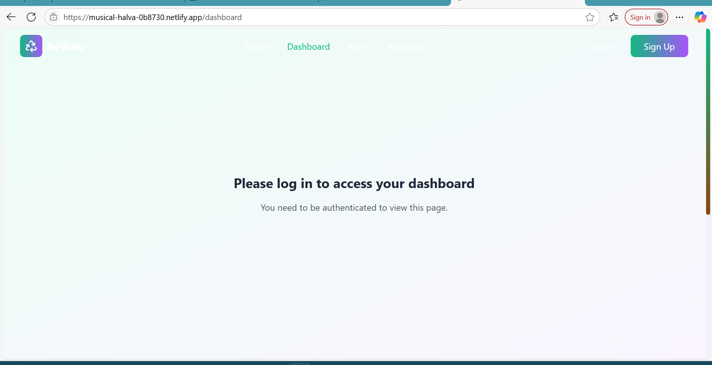
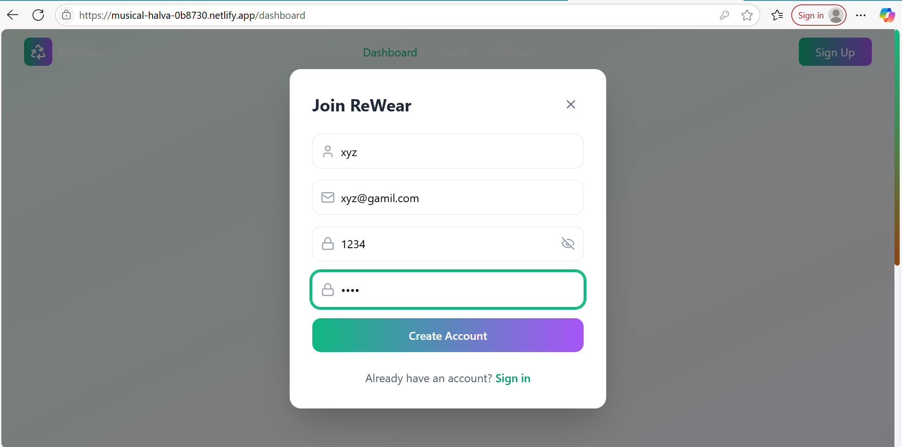
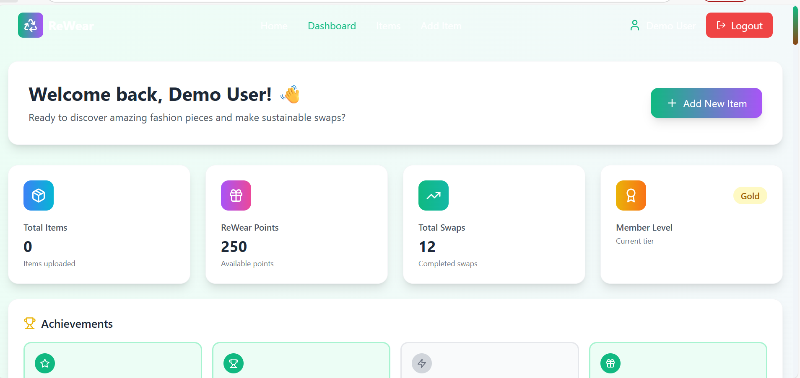
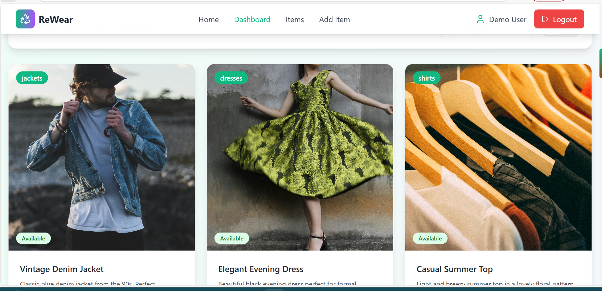
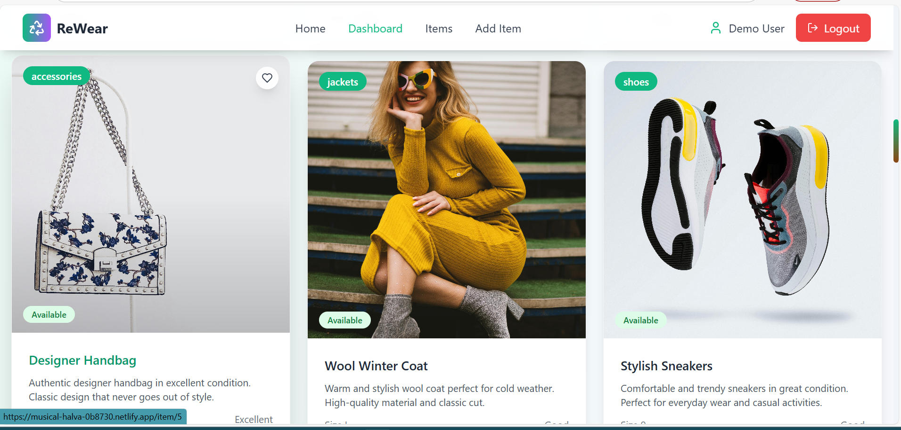

<h1 align="center">
  👕♻️ ReWear - Clothing Exchange Platform ♻️👗  
</h1>

<p align="center">
  
  
  
</p>

<p align="center">
  <b>♻️ Your Closet's Second Chance, Someone Else's First Choice! ♻️</b><br>
  <i>A user-friendly platform to exchange pre-loved clothes, reducing textile waste and promoting a circular economy.</i>
</p>

---

## 🌐 Live Demo
🔗 Check out the website here 👉 [ReWear Clothing Exchange](https://musical-halva-0b8730.netlify.app)

---

## ✨ Features

- 👚 Add and Exchange Clothes
- 🔍 Search & Filter Clothes by Category, Gender, Size, or Location
- 🧑‍🤝‍🧑 Community-driven Exchange
- 📦 Post Request for Clothes or Donate
- 🗺️ Integrated Location-based Matching
- 💬 Easy Contact & Communication between Users
- 🔐 Secure Authentication & Responsive UI

---

## 🧑‍💻 Tech Stack Used

| Technology | Description |
|------------|-------------|
|  **React.js** | Frontend Library |
|  **JavaScript** | Logic and interactivity |
|  **HTML5** | Structure of the web pages |
|  **CSS3** | Styling and layout |
|  **Node.js** | Backend server |
|  **Express.js** | Web framework for Node |
|  **MongoDB** | NoSQL Database |
|  **Git** | Version control |
|  **GitHub** | Code Hosting |

---

## 📸 Screenshots


Explore key sections of the **ReWear Web App** through the following interface snapshots:

### 1️⃣ Landing Page
The homepage welcomes users with a clean layout, logo, and call-to-action that introduces ReWear's sustainable fashion concept.


---

### 2️⃣ Restricted Dashboard View (Authentication Required)
If a user attempts to access the dashboard without logging in, an access prompt or redirect appears—reinforcing secure access controls.



---

### 3️⃣ Login Page
Simple login interface enabling registered users to enter credentials and access personalized features.



---

### 4️⃣ User Dashboard
Once logged in, users can view their dashboard—featuring swap requests, item listings, and redeem history.



---

### 5️⃣ & 6️⃣ Product Display Section
Browse page showcasing clothing items with filters like Category, Size, Condition, and Transaction Type. Items include denim jackets, sarees, cardigans, and more.

  



---

## 🚀 How to Run Locally

```bash
# Clone the repository
git clone https://github.com/Vaishnavishah25/Codvengers.git

# Navigate to the folder
cd ReWear\ -\ Clothing_Exchange

# Install dependencies
npm install

# Run the project
npm start
